<!-- Page de présentation -->
<div align="center">

<!-- Titre du document (18 pts) -->
<center>
<h1 style="font-size:18pt;">
Rapport du laboratoire 3
</h1>
</center>

<!-- 4 retours à interligne simple (18 pts) -->
<br>
<br>
<br>
<br>

<!-- (16 pts) -->
<center>
<h2 style="font-size:16pt;">
PAR
</h2>
</center>

<!-- 2 retours à interligne simple (16 pts) -->
<br>
<br>

<!-- Prénom et NOM DE FAMILLE, CODE PERMANENT (16 pts) -->
<center>
<h2 style="font-size:16pt;">
David NGUYEN, NGUD24049607
</h2>
</center>

<!-- 6* retours à interligne simple (16 pts) -->
<!-- * Devrait être 5 retours -->
<br>
<br>
<br>
<br>
<br>
<br>

<!-- Note de présentation (14 pts) -->
<center>
<h3 style="font-size:14pt;">
RAPPORT PRÉSENTÉ À FABIO PETRILLO DANS LE CADRE DU COURS <em>ARCHITECTURE LOGICIELLE</em> (LOG430-02)
</h3>
</center>

<!-- 5 retours à interligne simple (14 pts) -->
<br>
<br>
<br>
<br>
<br>

<!-- Date de remise (14 pts) -->
<center>
<h3 style="font-size:14pt;">
MONTRÉAL, LE 3 OCTOBRE 2025
</h3>
</center>

<!-- 5 retours à interligne simple (14 pts) -->
<br>
<br>
<br>
<br>
<br>

<!-- Date de présentation (14 pts) -->
<center>
<h3 style="font-size:14pt;">
ÉCOLE DE TECHNOLOGIE SUPÉRIEURE<br>
UNIVERSITÉ DU QUÉBEC
</h3>
</center>

<!-- 5 retours à interligne simple (14 pts) -->
<br>
<br>
<br>
<br>
<br>

</div>  


---  
<h1> Tables des matières </h1>

- [Mise en place](#mise-en-place)
- [Question 1](#question-1)
- [Question 2](#question-2)
- [Question 3](#question-3)
- [Question 4](#question-4)
- [Question 5](#question-5)
- [Question 6](#question-6)

---

# Mise en place
Le projet a été fork, puis ensuite clôné. Au niveau de Docker, dans le terminal, j'ai effectué la commande pour créer un réseau Docker et pour préparer l'environnement de développement. Par la suite, j'ai importé la collection disponible dans `/docs/collections`. 

# Question 1
> Quel nombre d'unités de stock pour votre article avez-vous obtenu à la fin du test ? Et pour l'article avec id=2 ? Veuillez inclure la sortie de votre Postman pour illustrer votre réponse.

D'abord, on cree un article "Some item":
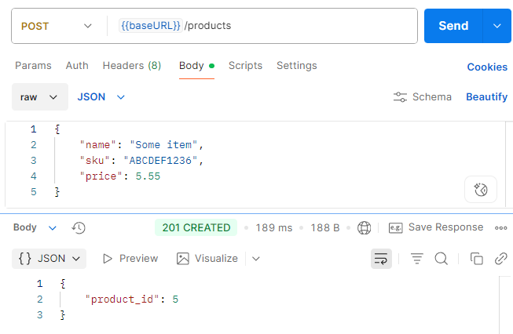

Ensuite, on y ajoute 5 unités au stock de cet article:
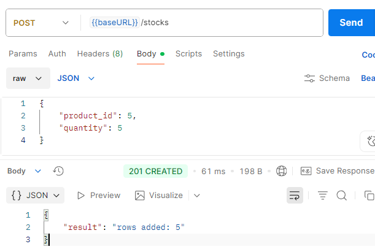

Vérifions qu'il y en a bien 5 unités pour l'article (id = 5):
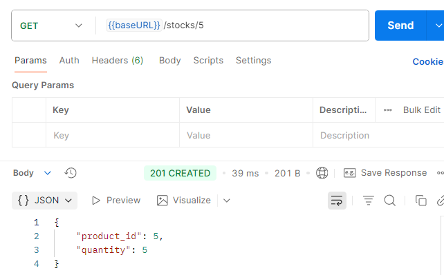

Maintenant, créons une commande de 2 unités de l'article en question:
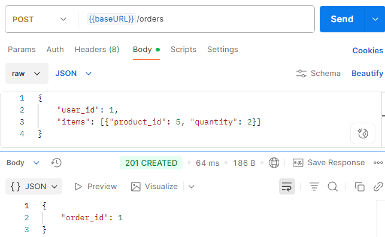

Re-vérifions le stock:
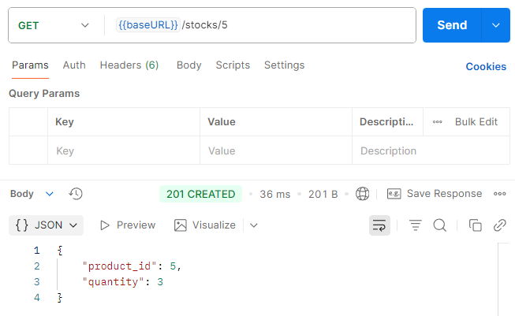

Finalement, supprimons la commande et vérifions que le stock est revenu à 5:
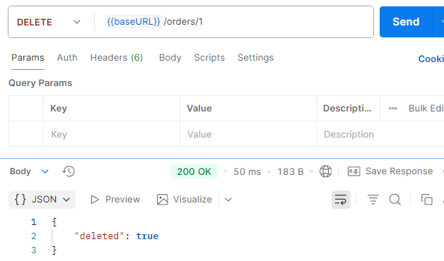
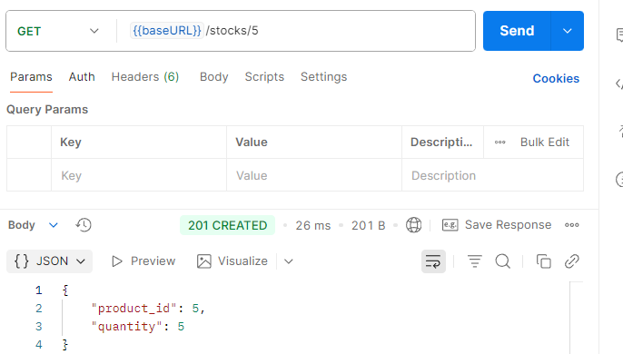

En ce qui concerne l'article avec id = 2, commençons avec l'obtention de sa quantité initiale:
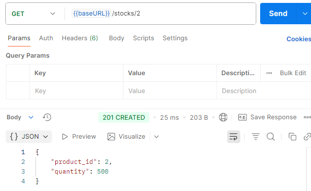

Ensuite, en passant une commande de 2 unités, il va lui en rester 498:
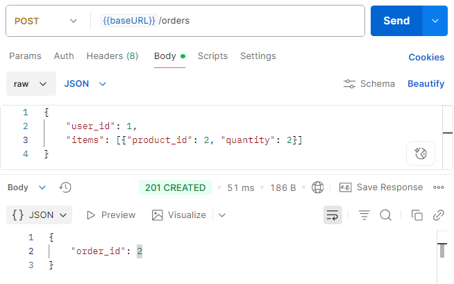
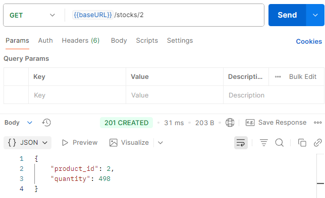

Finalement, supprimons la commande (id = 2) et vérifions que le stock est revenu à 500:
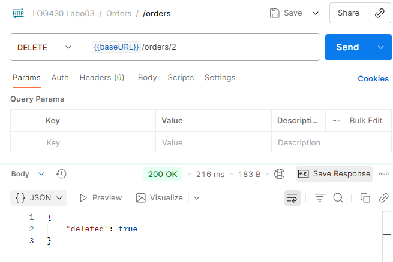
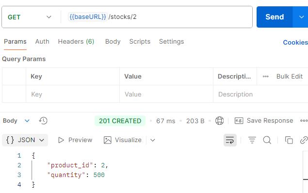

# Question 2
> Décrivez l'utilisation de la méthode join dans ce cas. Utilisez les méthodes telles que décrites à Simple Relationship Joins et Joins to a Target with an ON Clause dans la documentation SQLAlchemy pour ajouter les colonnes demandées dans cette activité. Veuillez inclure le code pour illustrer votre réponse.

Le besoin est d'enrichir les informations de stock avec les détails des produits (nom, SKU, prix). Sachant que les données sont réparties dans deux tables:
- stocks: contient `product_id` et `quantity`;
- products: contient `id`, `name`, `sku` et `price`;

Dans notre cas, on utilise un JOIN simple entre ces deux tables liées par une clé étrangère:
```
session.query(
    Stock.product_id,
    Stock.quantity,
    Product.name,
    Product.sku,
    Product.price
).join(Product, Stock.product_id == Product.id) # Joins to a Target with an ON Clause
```
Initialement, voici ce que la route `/stocks/reports/overview-stocks` donne:
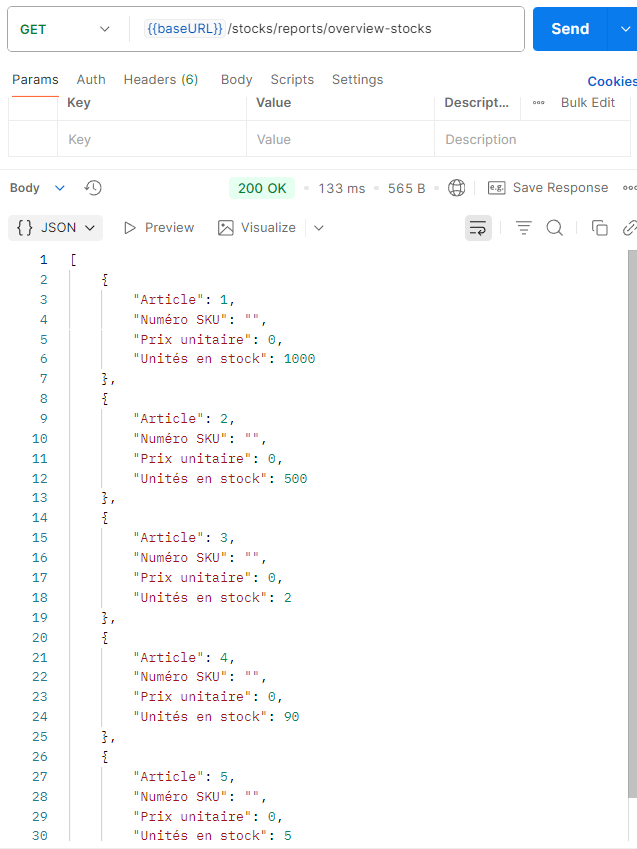

Voici le code pour la méthode `get_stock_for_all_product`:
```
def get_stock_for_all_products():
    """Get stock quantity for all products with product details using JOIN"""
    session = get_sqlalchemy_session()
    
    # Utilisation de join() pour joindre Stock avec Product
    # Join simple basé sur la relation de clé étrangère
    results = session.query(
        Stock.product_id,
        Stock.quantity,
        Product.name,
        Product.sku,
        Product.price
    ).join(Product, Stock.product_id == Product.id).all()
    
    stock_data = []
    for row in results:
        stock_data.append({
            'Article': row.name,  # Maintenant on utilise le nom du produit
            'Numéro SKU': row.sku,  # SKU du produit
            'Prix unitaire': float(row.price),  # Prix du produit
            'Unités en stock': int(row.quantity),
        })
    
    return stock_data
```

Ainsi, on peut voir que les informations se peuplent plus aisément:
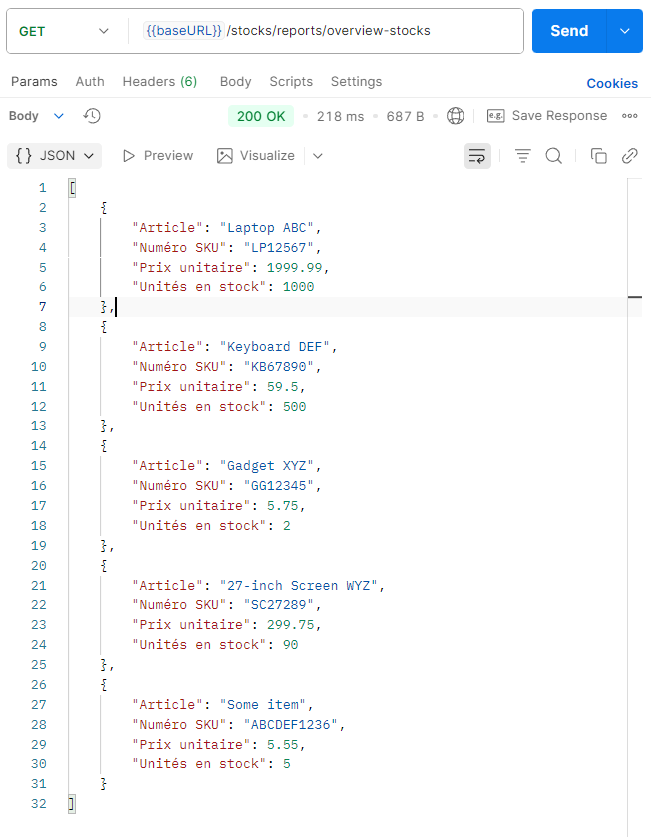

# Question 3
> Quels résultats avez-vous obtenus en utilisant l’endpoint POST /stocks/graphql-query avec la requête suggérée ? Veuillez joindre la sortie de votre requête dans Postman afin d’illustrer votre réponse.
Initialement, lorsqu'on utilise l'endpoint `POST /stocks/graphql-query`, on obtient aucune donnée:
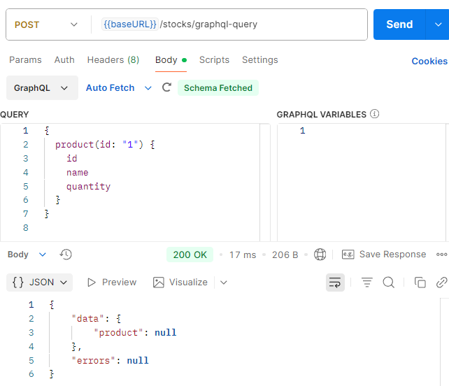

Cela est normal considérant le fait que la base de données Redis est vide (cache qui est séparé de MySQL qui contient les données principales).

Avec la commande suivante:
```
docker-compose exec store_manager python -c "
from stocks.commands.write_stock import _populate_redis_from_mysql
from db import get_redis_conn
redis_conn = get_redis_conn()
print('\n=== Peuplement de Redis avec _populate_redis_from_mysql ===')
_populate_redis_from_mysql(redis_conn)"
```
Cela nous a permis d'ajouter des données dans Redis (à partir des données de MySQL) pour voir concrètement le retour de l'appel au endpoint de GraphQL:
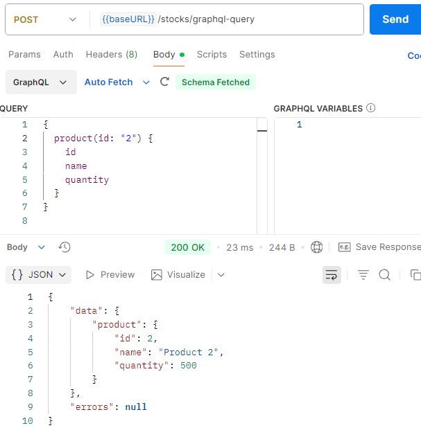

# Question 4
>

D'abord, dans le schéma Product, les colonnes manquantes ont été ajoutées comme suit:
```
class Product(ObjectType):
    id = Int()
    name = String()
    sku = String() # Nouvelle colonne ajoutée
    price = Float() # Nouvelle colonne ajoutée
    quantity = Int()
```

Par la suite, la méthode `resolve_product` a été modifiée pour retourner les nouvelles colonnes:
```
def resolve_product(self, info, id):
        """ Create an instance of Product based on stock info for that product that is in Redis """
        redis_client = get_redis_conn()
        product_data = redis_client.hgetall(f"stock:{id}")
        if product_data:
            return Product(
                id=int(id),
                name=product_data.get('name', f"Product {id}"),
                sku=product_data.get('sku', f"SKU{id}"),
                price=float(product_data.get('price', 0.0)),
                quantity=int(product_data.get('quantity', 0))
            )
        return None
```

Ainsi, voici la méthode adaptée `update_stock_redis`:
```
def update_stock_redis(order_items, operation):
    """ Update stock quantities in Redis with complete product information """
    if not order_items:
        return
    r = get_redis_conn()
    stock_keys = list(r.scan_iter("stock:*"))
    if stock_keys:
        # Récupérer les informations des produits depuis MySQL
        session = get_sqlalchemy_session()
        try:
            pipeline = r.pipeline()
            for item in order_items:
                if hasattr(item, 'product_id'):
                    product_id = item.product_id
                    quantity = item.quantity
                else:
                    product_id = item['product_id']
                    quantity = item['quantity']
                    
                # Récupérer les informations complètes du produit
                product_info = session.execute(
                    text("SELECT name, sku, price FROM products WHERE id = :pid"),
                    {"pid": product_id}
                ).fetchone()
                
                current_stock = r.hget(f"stock:{product_id}", "quantity")
                current_stock = int(current_stock) if current_stock else 0
                
                if operation == '+':
                    new_quantity = current_stock + quantity
                else:  
                    new_quantity = current_stock - quantity
                
                # Mettre à jour avec toutes les informations du produit
                if product_info:
                    pipeline.hset(f"stock:{product_id}", mapping={
                        "quantity": new_quantity,
                        "name": product_info.name,
                        "sku": product_info.sku,
                        "price": float(product_info.price)
                    })
                else:
                    pipeline.hset(f"stock:{product_id}", "quantity", new_quantity)
            
            pipeline.execute()
        finally:
            session.close()
    
    else:
        _populate_redis_from_mysql(r)
```

# Question 5
>  Quels résultats avez-vous obtenus en utilisant l’endpoint POST /stocks/graphql-query avec les améliorations ? Veuillez joindre la sortie de votre requête dans Postman afin d’illustrer votre réponse.

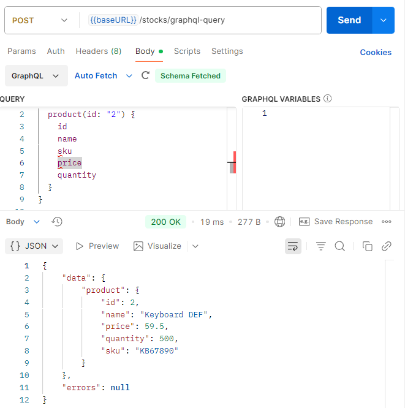

# Question 6
> Examinez attentivement le fichier docker-compose.yml du répertoire scripts, ainsi que celui situé à la racine du projet. Qu’ont-ils en commun ? Par quel mécanisme ces conteneurs peuvent-ils communiquer entre eux ? Veuillez joindre du code YML afin d’illustrer votre réponse.

Leur point en commun est que les deux fichiers utilisent le même réseau Docker:
```
networks:
  labo03-network:
    driver: bridge
    external: true
```
De ce fait, les conteneurs peuvent communiquer entre eux grâce au réseau `bridge` et `external` impliquant un partage entre plusieurs `docker compose` (fichier placé dans la racine du projet ainsi que celui dans /scripts/). Cela permet de se découvrir par DNS leur nom de service sur leur même réseau. Par exemple, le conteneur `supplier_app` peut communiquer avec `store_manager` via `http://store_manager:5000` 